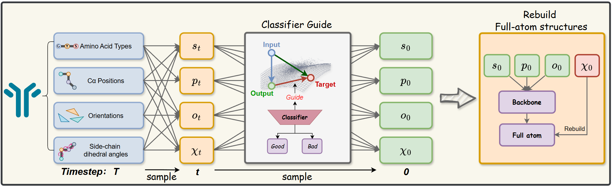
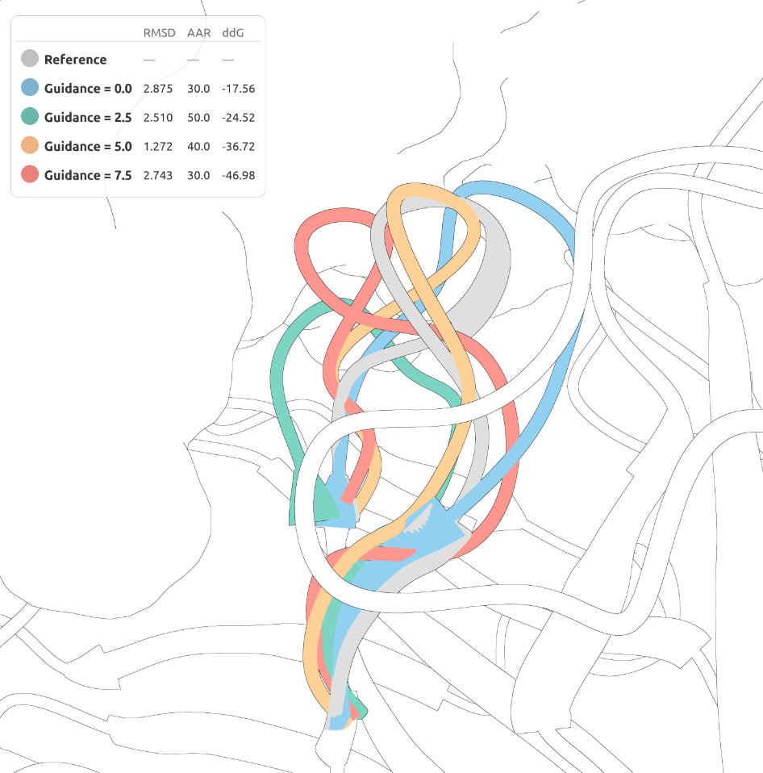

# Chi-Guide: Towards Controllable Antibody Design via Torsion Angle Diffusion and Property Guidance

Chi-Guide is a diffusion-based framework for antigen-specific antibody CDR design that incorporates explicit side-chain torsion angle ($\chi$-angle) representation and classifier guidance for controllable generation.

---

## Overview

Existing backbone-level diffusion models for antibody design discard side-chain information during generation, limiting both structural quality and the ability to apply gradient-based property guidance. Chi-Guide addresses this by jointly diffusing backbone geometry and side-chain torsion angles ($\chi_1$–$\chi_4$), providing differentiable atomic coordinates at every denoising step. A lightweight classifier trained on noisy intermediate states steers sampling toward improved binding affinity without modifying the base generative model.

---

---

## CDR Design Example

CDR-H3 loop conformations generated at guidance scales w ∈ {0.0, 2.5, 5.0, 7.5}, overlaid on the reference structure (gray). As guidance scale increases, the loop progressively achieves lower binding energy (ΔΔG).

---

## Code Availability

The code and pretrained models will be made publicly available upon acceptance.

---

## License

This project will be released under the MIT License.
